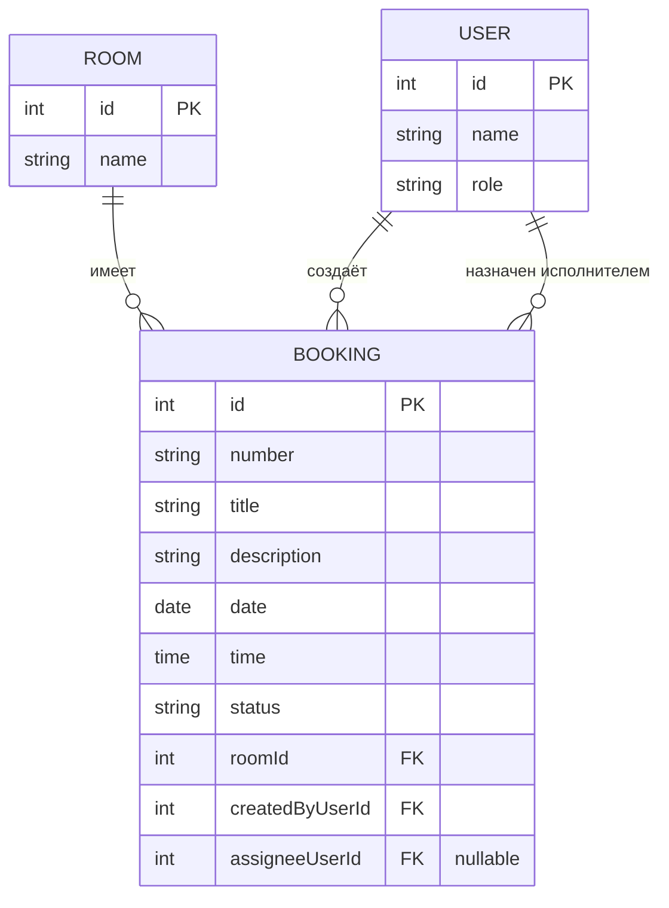

# Модель данных

**Тема:** Информационная система бронирования спортивного зала
**Студент:** Закиров Рамзиль Ангамович · **Группа:** ТРИС-2-23
**Лабораторная работа №2**

---

## 1. Словарь проекта

Соответствие терминов курса терминам темы. Эти имена используются во всех документах, API и коде семестра и не меняются.

| Термин курса | Термин моей темы |
|---|---|
| Ticket (заявка) | Booking (бронь зала) |
| Site (справочник) | Room (спортивный зал) |
| User (диспетчер / исполнитель) | преподаватель физкультуры / администратор зала |

Путь API главного объекта: `/api/bookings`.

## 2. Сущности

### 2.1. Booking (бронь зала) — главный объект

| Поле | Тип | Ключ | Описание |
|---|---|---|---|
| `id` | integer | **PK** | Машинный первичный ключ. Используется в адресах API: `/api/bookings/17` |
| `number` | string | — | Человеческий номер брони, например «Б-17». Не заменяет `id` |
| `title` | string | — | Заголовок брони (5–80 символов) |
| `description` | string | — | Описание бронирования (10–500 символов) |
| `date` | date | — | Дата бронирования |
| `time` | time | — | Время бронирования |
| `status` | string | — | Один из четырёх кодов: `New`, `InProgress`, `Closed`, `Cancelled` |
| `roomId` | integer | **FK** → Room.id | Ссылка на спортивный зал |
| `createdByUserId` | integer | **FK** → User.id | Кто создал бронь (преподаватель физкультуры) |
| `assigneeUserId` | integer | **FK** → User.id, nullable | Исполнитель (администратор зала). При создании отсутствует |

### 2.2. Room (спортивный зал) — справочник

| Поле | Тип | Ключ | Описание |
|---|---|---|---|
| `id` | integer | **PK** | Машинный первичный ключ |
| `name` | string | — | Название зала, например «Большой спортзал» |

### 2.3. User (пользователь)

| Поле | Тип | Ключ | Описание |
|---|---|---|---|
| `id` | integer | **PK** | Машинный первичный ключ |
| `name` | string | — | Имя или логин |
| `role` | string | — | Роль: `Teacher` (преподаватель физкультуры) или `RoomAdmin` (администратор зала) |

## 3. ER-диаграмма

## 4. Связи (подписаны словами)

- Один **зал** — много **броней** (1:N). Каждая бронь относится ровно к одному залу.
- Один **преподаватель** создаёт много **броней** (1:N).
- Один **администратор зала** может быть исполнителем многих **броней** (1:N).
- У новой брони исполнитель может отсутствовать: связь «назначен» необязательная, `assigneeUserId` допускает NULL до отдельного действия назначения.

## 5. Проверка 3НФ

Название зала хранится в сущности Room один раз. Booking содержит только внешний ключ `roomId`. При переименовании зала меняется одна строка в таблице Room, поэтому текст названия не дублируется в бронях. Аналогично имя пользователя хранится только в User, а брони ссылаются на него через `createdByUserId` и `assigneeUserId`.

## 6. Статусы и переходы

Коды статусов в API и БД фиксированы (НФТ-3), на экране отображаются по-русски:

| Код | На экране | Кто может установить |
|---|---|---|
| `New` | Новая | ставится сервером при создании (POST) |
| `InProgress` | В работе | администратор зала — только для своей назначенной брони (ФТ-7) |
| `Closed` | Завершена | администратор зала — только для своей назначенной брони (ФТ-8) |
| `Cancelled` | Отменена | администратор зала в предусмотренных процессом случаях (ФТ-9) |

Переходы: `New → InProgress → Closed`, а также `New → Cancelled` и `InProgress → Cancelled`. Удаления строки нет: отмена — это статус `Cancelled`, запись остаётся в базе.

Администратор не может изменить статус брони, которая не назначена ему (ФТ-10) — сервер отклоняет такую операцию с кодом `409`.
